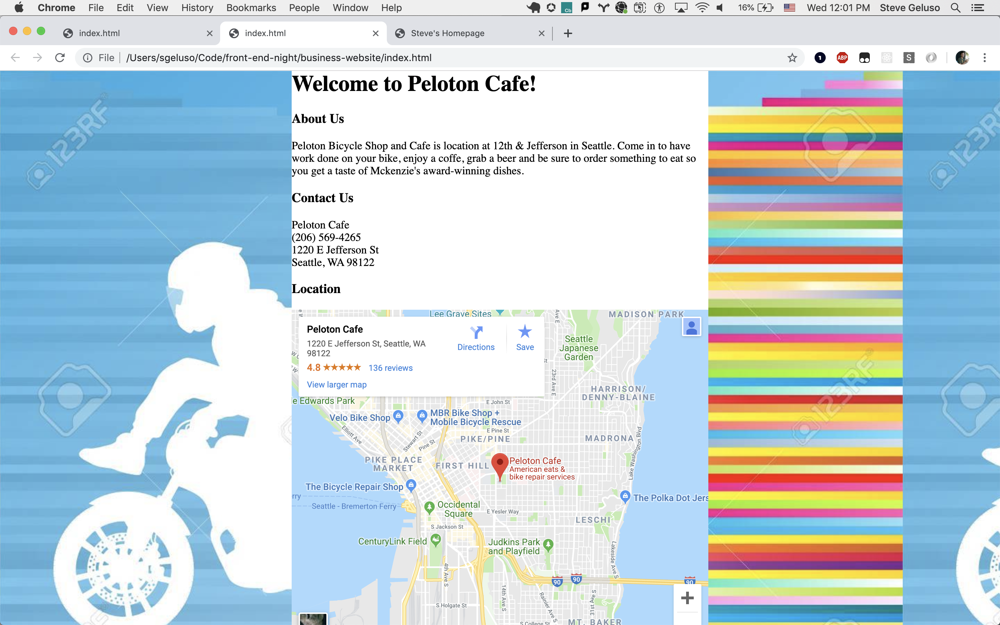

# Intro to HTML and CSS
## Goals
* Introduce Text Editors
  * Explain why we don't use something like Microsoft Word
  * Visual Studio Code / Atom / Whatever
* Introduce HTML syntax
  * tags, atributes, text
* Show common HTML tags
  * paragraphs, headings
  * bold, italic, underline
  * images, links
  * lists, tables
  * divs
* Introduce CSS syntax
  * selectors, properties, values
* Show Common CSS
  * selecting elements, classes, ids
  * color, background color
  * borders, border-radius
  * width, height
  * font size
  * :hover, :visited
  * margin, padding
* Show Common Website examples
  * Baby Shower Webpage
  * Business webpage with Google Maps
  * HTML Tables with top 10 movies
  * Personal homepage with images, videos and links

# Example Websites

